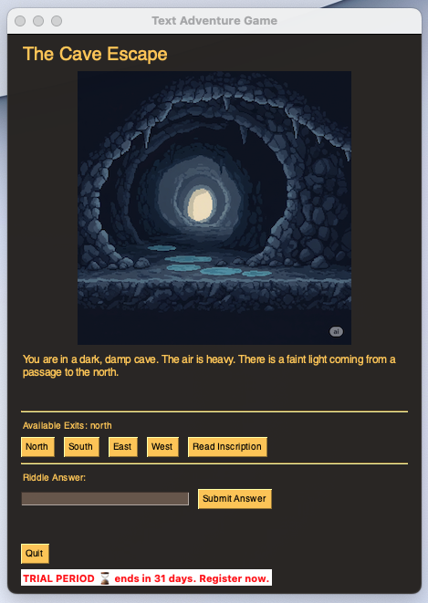

# The Cave Escape - A Text Adventure GUI Game



A classic text-based adventure game brought to life with a graphical user interface built in Python using PySimpleGUI. The player wakes up in a dark cave and must explore, solve a riddle, and find the exit.

---

## ✨ Features

* **Graphical User Interface:** A user-friendly point-and-click interface, no terminal commands needed.
* **Dynamic Visuals:** Each room features unique pixel art to enhance immersion.
* **Interactive Puzzle:** Players must solve a riddle to unlock the final path.
* **State Management:** The game remembers the player's progress and the state of the world (e.g., if a door is locked or unlocked).

---

## 🛠️ Technologies Used

* **Python 3**
* **PySimpleGUI (psg-fork):** For the entire graphical user interface.
* **AI Art Generation:** All visual assets were generated using AI prompts.

---

## 🚀 How to Run

1.  **Clone the repository:**
    ```sh
    git clone [https://github.com/Larihb/Text_adventure.git](https://github.com/Larihb/Text_adventure.git)
    cd SEU_REPOSITORIO
    ```
    2.  **Create a virtual environment (recommended):**
    ```sh
    python3 -m venv venv
    source venv/bin/activate
    ```
    3.  **Install the dependencies:**
    ```sh
    pip install -r requirements.txt
    ```

4.  **Run the game!**
    ```sh
    python main_gui.py
    ```

---

## 🎓 What I Learned

This project was a deep dive into building a complete application from the ground up. Key learnings include:

* **Object-Oriented Programming (OOP):** Structuring the game's logic into a `Game` class.
* **GUI Development:** Learning the fundamentals of event-driven programming and building a user interface with PySimpleGUI.
* **Software Architecture:** The importance of separating application logic (`game_logic.py`) from the presentation layer (`main_gui.py`).
* **Debugging:** Systematically diagnosing and fixing a variety of bugs, from logical errors to environment-specific rendering issues.
* **Prompt Engineering:** Creating detailed prompts to generate consistent AI art for the game's assets.